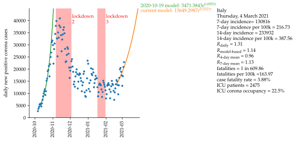
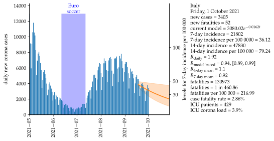
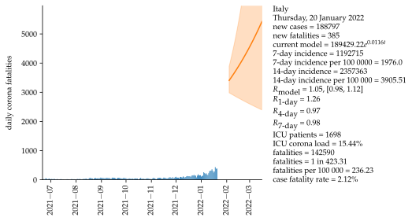
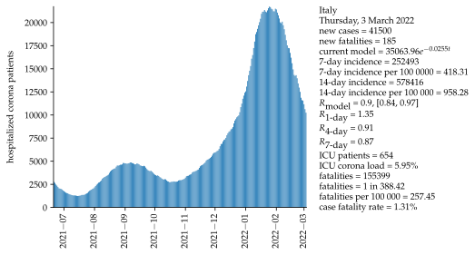
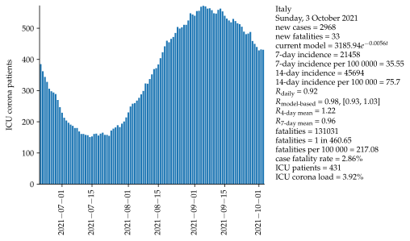

# Italy

Mathematical approximation of data for the COVID-19 pandemic in Italy.  Data starts on 6 October 2020. For the mathematical approximation, the last 14 days are used as a data basis, projecting the next 28 days. Exponential growth and a serial interval of four days are assumed.  Uncertainty of models is shown as an interval with one standard deviation above and below model value.

### Second wave

### WHO indicators

<iframe src="html/CaseIncidenceItalyAll.html"
    sandbox="allow-same-origin allow-scripts"
    width="100%"
    height="550"
    scrolling="no"
    seamless="seamless"
    frameborder="0">
</iframe>

<iframe src="html/MortalityWHOItalyAll.html"
    sandbox="allow-same-origin allow-scripts"
    width="100%"
    height="550"
    scrolling="no"
    seamless="seamless"
    frameborder="0">
</iframe>

### All data:

<iframe src="html/positiveItalyAll.html"
    sandbox="allow-same-origin allow-scripts"
    width="100%"
    height="550"
    scrolling="no"
    seamless="seamless"
    frameborder="0">
</iframe>

<iframe src="html/newPositiveItalyAll.html"
    sandbox="allow-same-origin allow-scripts"
    width="100%"
    height="550"
    scrolling="no"
    seamless="seamless"
    frameborder="0">
</iframe>

<iframe src="html/totalPositiveItalyAll.html"
    sandbox="allow-same-origin allow-scripts"
    width="100%"
    height="550"
    scrolling="no"
    seamless="seamless"
    frameborder="0">
</iframe>

<iframe src="html/deceasedItalyAll.html"
    sandbox="allow-same-origin allow-scripts"
    width="100%"
    height="550"
    scrolling="no"
    seamless="seamless"
    frameborder="0">
</iframe>

<iframe src="html/newDeceasedItalyAll.html"
    sandbox="allow-same-origin allow-scripts"
    width="100%"
    height="550"
    scrolling="no"
    seamless="seamless"
    frameborder="0">
</iframe>

<iframe src="html/FatalityRateItalyAll.html"
    sandbox="allow-same-origin allow-scripts"
    width="100%"
    height="550"
    scrolling="no"
    seamless="seamless"
    frameborder="0">
</iframe>

<iframe src="html/hospitalizedItalyAll.html"
    sandbox="allow-same-origin allow-scripts"
    width="100%"
    height="550"
    scrolling="no"
    seamless="seamless"
    frameborder="0">
</iframe>

<iframe src="html/intensiveItalyAll.html"
    sandbox="allow-same-origin allow-scripts"
    width="100%"
    height="550"
    scrolling="no"
    seamless="seamless"
    frameborder="0">
</iframe>

<iframe src="html/ICULoadItalyAll.html"
    sandbox="allow-same-origin allow-scripts"
    width="100%"
    height="550"
    scrolling="no"
    seamless="seamless"
    frameborder="0">
</iframe>

### Basis data:

Corona values [[1]](#1).

### Assumptions:

Exponential growth.

Serial interval = 4 days [[2]](#2).

Fatality interval (between test and fatality) = 4 weeks.

Calculation of R4 and R7, see [[2]](#2).

### Sources

<a id="1">[1]</a>
<https://github.com/pcm-dpc/COVID-19>
    
<a id="2">[2]</a> 
<https://www.rki.de/DE/Content/InfAZ/N/Neuartiges_Coronavirus/Projekte_RKI/R-Wert-Erlaeuterung.pdf?__blob=publicationFile>
