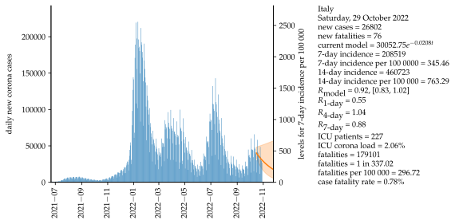
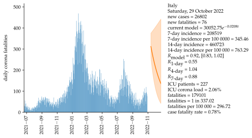

# Italy

Mathematical approximation of data for the second wave of COVID-19 in Italy with data starting on 6 October 2020. Exponential growth and a serial interval of four days are assumed.

### WHO indicators:

<iframe src="html/CaseIncidenceItalyAll.html"
    sandbox="allow-same-origin allow-scripts"
    width="100%"
    height="550"
    scrolling="no"
    seamless="seamless"
    frameborder="0">
</iframe>

<iframe src="html/MortalityWHOItalyAll.html"
    sandbox="allow-same-origin allow-scripts"
    width="100%"
    height="550"
    scrolling="no"
    seamless="seamless"
    frameborder="0">
</iframe>

### Basis data:
Corona values [[1]](#1).

### Assumptions:
Exponential growth.

Serial interval = 4 days [[2]](#2).

Fatality interval (between test and fatality) = 4 weeks.

Calculation of R4 and R7, see [[2]](#2).

## Sources
<a id="1">[1]</a>  
https://github.com/pcm-dpc/COVID-19
    
<a id="2">[2]</a> 
https://www.rki.de/DE/Content/InfAZ/N/Neuartiges_Coronavirus/Projekte_RKI/R-Wert-Erlaeuterung.pdf?__blob=publicationFile
