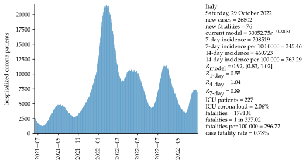
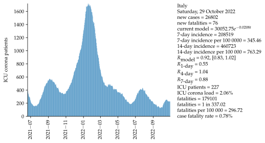

Mathematical approximation and data for COVID-19 in  Italy.  Data starts on 6 October 2020.  The first section represents the current situation starting mid-summer 2021. The second section includes the entire pandemic with data starting on February 24, 2020.  The mathematical approximation uses the last 14 days as a data basis, projecting the next 28 days. An exponential growth model using a serial interval of four days is assumed. Uncertainty of models is shown as an interval with one standard deviation to both sides of approximation.

## Data starting mid-summer 2021

### WHO indicators

<iframe src="html/CaseIncidenceItalyAll.html"
    sandbox="allow-same-origin allow-scripts"
    width="100%"
    height="550"
    scrolling="no"
    seamless="seamless"
    frameborder="0">
</iframe>

<iframe src="html/MortalityWHOItalyAll.html"
    sandbox="allow-same-origin allow-scripts"
    width="100%"
    height="550"
    scrolling="no"
    seamless="seamless"
    frameborder="0">
</iframe>

### All data:

<iframe src="html/positiveItalyAll.html"
    sandbox="allow-same-origin allow-scripts"
    width="100%"
    height="550"
    scrolling="no"
    seamless="seamless"
    frameborder="0">
</iframe>

<iframe src="html/newPositiveItalyAll.html"
    sandbox="allow-same-origin allow-scripts"
    width="100%"
    height="550"
    scrolling="no"
    seamless="seamless"
    frameborder="0">
</iframe>

<iframe src="html/totalPositiveItalyAll.html"
    sandbox="allow-same-origin allow-scripts"
    width="100%"
    height="550"
    scrolling="no"
    seamless="seamless"
    frameborder="0">
</iframe>

<iframe src="html/deceasedItalyAll.html"
    sandbox="allow-same-origin allow-scripts"
    width="100%"
    height="550"
    scrolling="no"
    seamless="seamless"
    frameborder="0">
</iframe>

<iframe src="html/newDeceasedItalyAll.html"
    sandbox="allow-same-origin allow-scripts"
    width="100%"
    height="550"
    scrolling="no"
    seamless="seamless"
    frameborder="0">
</iframe>

<iframe src="html/FatalityRateItalyAll.html"
    sandbox="allow-same-origin allow-scripts"
    width="100%"
    height="550"
    scrolling="no"
    seamless="seamless"
    frameborder="0">
</iframe>

<iframe src="html/hospitalizedItalyAll.html"
    sandbox="allow-same-origin allow-scripts"
    width="100%"
    height="550"
    scrolling="no"
    seamless="seamless"
    frameborder="0">
</iframe>

<iframe src="html/intensiveItalyAll.html"
    sandbox="allow-same-origin allow-scripts"
    width="100%"
    height="550"
    scrolling="no"
    seamless="seamless"
    frameborder="0">
</iframe>

<iframe src="html/ICULoadItalyAll.html"
    sandbox="allow-same-origin allow-scripts"
    width="100%"
    height="550"
    scrolling="no"
    seamless="seamless"
    frameborder="0">
</iframe>

### Basis data:

Corona values [[1]](#1).

### Assumptions:

Exponential growth.

Serial interval = 4 days [[2]](#2).

Fatality interval (between test and fatality) = 4 weeks.

Calculation of R4 and R7, see [[2]](#2).

### Sources

<a id="1">[1]</a>
<https://github.com/pcm-dpc/COVID-19>
    
<a id="2">[2]</a> 
<https://www.rki.de/DE/Content/InfAZ/N/Neuartiges_Coronavirus/Projekte_RKI/R-Wert-Erlaeuterung.pdf?__blob=publicationFile>
