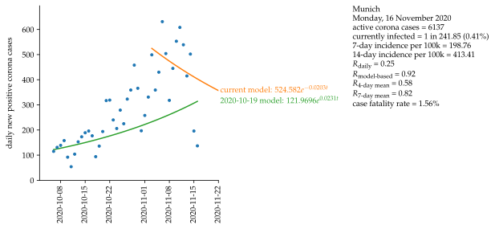
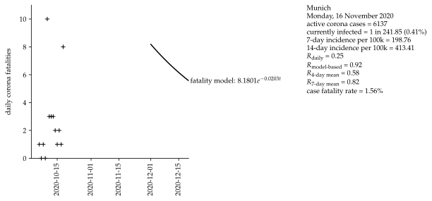

# Munich

Mathematical approximation of data for the second wave of COVID-19 in Munich, Germany with data starting on 6 October 2020. Exponential growth and a serial interval of four days are assumed.

### Basis data:
Corona values [[1]](#1).

### Assumptions:
Exponential growth.

Serial interval = 4 days [[2]](#2).

Fatality interval (between test and fatality) = 4 weeks.

Calculation of R4 and R7, see [[2]](#2).

## Sources
<a id="1">[1]</a> 
https://www.muenchen.de/rathaus/Stadtinfos/Coronavirus-Fallzahlen.html
    
<a id="2">[2]</a> 
https://www.rki.de/DE/Content/InfAZ/N/Neuartiges_Coronavirus/Projekte_RKI/R-Wert-Erlaeuterung.pdf?__blob=publicationFile
