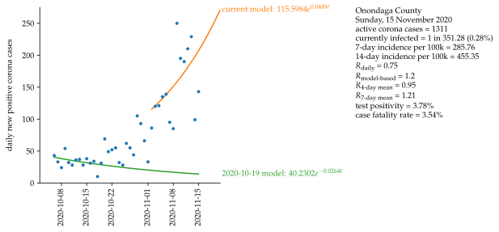
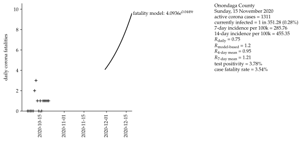

# Corona data, model and forecast for Onondaga County, New York, United States

Mathematical approximation of data for the second wave of COVID-19 in Onondaga County with data starting on 6 October 2020. Exponetial growth and a serial interval of four days are assumed.

### Basis data:
Corona values in Onondaga County [[1]](#1), [[2]](#2).

### Assumptions:
Exponential growth.

Serial interval = 4 days [[3]](#3).

Fatality interval (between test and fatality) = 4 weeks.

Calculation of R4 and R7, see [[3]](#3).

## Sources
<a id="1">[1]</a> 
https://covid19tracker.health.ny.gov/views/NYS-COVID19-Tracker/NYSDOHCOVID-19Tracker-DailyTracker?%3Aembed=yes&%3Atoolbar=no&%3Atabs=n
    
<a id="2">[2]</a> 
https://socpa.maps.arcgis.com/apps/opsdashboard/index.html#/7bd218bc8be04b209c0b80a83fc2eba5
   
<a id="3">[3]</a> 
https://www.rki.de/DE/Content/InfAZ/N/Neuartiges_Coronavirus/Projekte_RKI/R-Wert-Erlaeuterung.pdf?__blob=publicationFile
