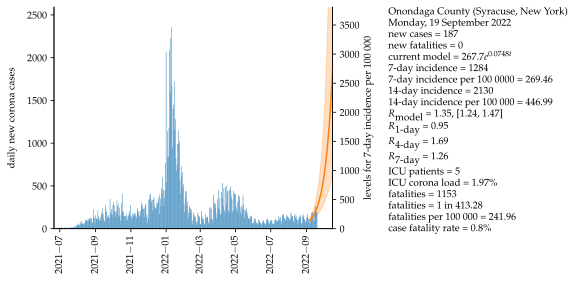
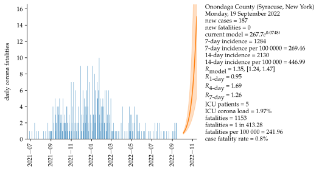
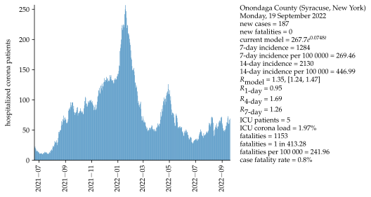
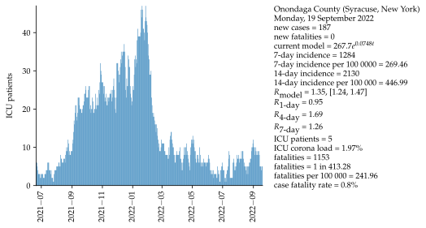
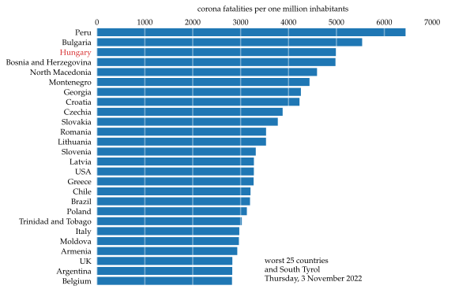

# Onondaga County (Syracuse, New York)

Mathematical approximation and data for COVID-19 in Onondaga County (Syracuse, New York).  The first section represents the current situation starting mid-summer 2021. The second section includes the entire pandemic with data starting on March 16, 2020.  The mathematical approximation uses the last 14 days as a data basis, projecting the next 28 days. An exponential growth model using a serial interval of four days is assumed. Uncertainty of models is shown as an interval with one standard deviation to both sides of the approximation.

## Data starting mid-summer 2021

## Comparison of fatality statistics

## Data starting March 16, 2020

### WHO indicators

<iframe src="html/CaseIncidenceOnondagaCounty(Syracuse,NewYork)All.html"
    sandbox="allow-same-origin allow-scripts"
    width="100%"
    height="550"
    scrolling="no"
    seamless="seamless"
    frameborder="0">
</iframe>

<iframe src="html/MortalityWHOOnondagaCounty(Syracuse,NewYork)All.html"
    sandbox="allow-same-origin allow-scripts"
    width="100%"
    height="550"
    scrolling="no"
    seamless="seamless"
    frameborder="0">
</iframe>

### Case and testing statistics

<iframe src="html/newPositiveTestedOnondagaCounty(Syracuse,NewYork)All.html"
    sandbox="allow-same-origin allow-scripts"
    width="100%"
    height="550"
    scrolling="no"
    seamless="seamless"
    frameborder="0">
</iframe>

<iframe src="html/positiveTestedOnondagaCounty(Syracuse,NewYork)All.html"
    sandbox="allow-same-origin allow-scripts"
    width="100%"
    height="550"
    scrolling="no"
    seamless="seamless"
    frameborder="0">
</iframe>

### Hospital statistics

<iframe src="html/numberHospitalizedPeopleOnondagaCounty(Syracuse,NewYork)All.html"
    sandbox="allow-same-origin allow-scripts"
    width="100%"
    height="550"
    scrolling="no"
    seamless="seamless"
    frameborder="0">
</iframe>

<iframe src="html/numberIntensiveTherapyOnondagaCounty(Syracuse,NewYork)All.html"
    sandbox="allow-same-origin allow-scripts"
    width="100%"
    height="550"
    scrolling="no"
    seamless="seamless"
    frameborder="0">
</iframe>

<iframe src="html/ICULoadOnondagaCounty(Syracuse,NewYork)All.html"
    sandbox="allow-same-origin allow-scripts"
    width="100%"
    height="550"
    scrolling="no"
    seamless="seamless"
    frameborder="0">
</iframe>

### Fatality statistics

<iframe src="html/deceasedOnondagaCounty(Syracuse,NewYork)All.html"
    sandbox="allow-same-origin allow-scripts"
    width="100%"
    height="550"
    scrolling="no"
    seamless="seamless"
    frameborder="0">
</iframe>

<iframe src="html/newDeceasedOnondagaCounty(Syracuse,NewYork)All.html"
    sandbox="allow-same-origin allow-scripts"
    width="100%"
    height="550"
    scrolling="no"
    seamless="seamless"
    frameborder="0">
</iframe>

<iframe src="html/FatalityRateOnondagaCounty(Syracuse,NewYork)All.html"
    sandbox="allow-same-origin allow-scripts"
    width="100%"
    height="550"
    scrolling="no"
    seamless="seamless"
    frameborder="0">
</iframe>

## Basis data:

Corona values [[1]](#1).

Number of ICU beds = 254 [[4]](#4).

Population = 476,516 (2020) [[5]](#5).

## Appoximation assumptions

Exponential growth.

Serial interval = 4 days  [[2]](#2).

Fatality interval (between test and fatality) = 4 weeks.

Calculation of R4 and R7, see [[2]](#2).

Basic reproduction number R0 = 5.7 [[4]](#4).

Calculation of effective reproduction number Rt is carried out via a four-day mean  R4 and a seven-day mean R7 (considering the serial interval), see [[2]](#2). The model-based approximation utilizes the exponential model to find the effective reproduction number.

Assumptions for community spreading ([[3]](#3)).:\
Testing positivity:\
 <2%: low incidence of community spreading,\
 <5%: moderate incidence of community spreading,\
 <20%: high incidence of community spreading,\
 \>20%: very high incidence of community spreading.\
Hospitalization rate:\
 <5%: low incidence of community spreading,\
 <10%: moderate incidence of community spreading,\
 <30%: high incidence of community spreading,\
 \>30%: very high incidence of community spreading.

## Sources

<a id="1">[1]</a>
https://covid19.ongov.net

<a id="2">[2]</a>
<https://www.rki.de/DE/Content/InfAZ/N/Neuartiges_Coronavirus/Projekte_RKI/R-Wert-Erlaeuterung.pdf?__blob=publicationFile>

<a id="6">[6]</a>
<https://www.who.int/publications/i/item/considerations-in-adjusting-public-health-and-social-measures-in-the-context-of-covid-19-interim-guidance>

<a id="3">[3]</a>
Sanche, S.; Lin, Y. T.; Xu, C.; Romero-Severson, E.; Hengartner, E.; Ke, R. (2020). "High Contagiousness and Rapid Spread of Severe Acute Respiratory Syndrome Coronavirus 2". Emerging Infectious Diseases. 26 (7):1470–1477. doi:10.3201/eid2607.200282.

<a id="4">[4]</a>
https://datacentral.kitsapsun.com/covid-19-hospital-capacity/new-york/36/onondaga-county/36067/

<a id="5">[5]</a>
https://www.census.gov/quickfacts/onondagacountynewyork
