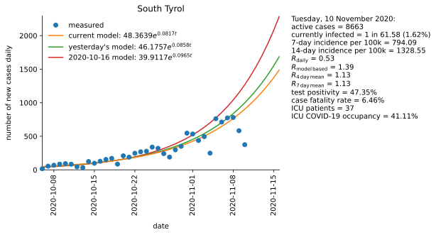
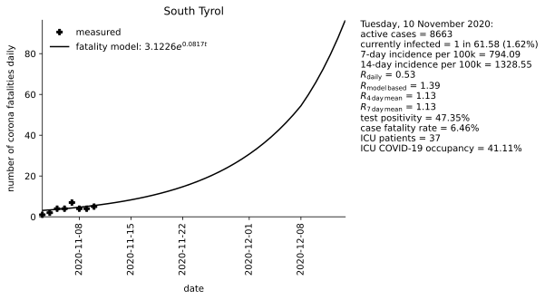
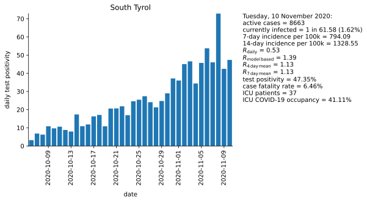

# Corona data, model and forecast for South Tyrol

Mathematical approximation of data for the second wave of COVID-19 in South Tyrol starting on 6 October 2020. Exponetial growth and a serial interval  of four days are assumed.

### Basis data:

Number of ICU beds = 90 [[4]](#4).

Population = 533439 [[2]](#2).

Corona values in South Tyrol [[1]](#1),[[5]](#5).

### Assumptions:

Exponential growth.

Serial interval = 4 days [[3]](#3).

Fatality interval (between test and fatality) = 4 weeks.

Calculation of R4 and R7, see [[3]](#3).

## Sources
<a id="1">[1]</a> 
http://www.provinz.bz.it/sicherheit-zivilschutz/zivilschutz/aktuelle-daten-zum-coronavirus.asp

<a id="2">[2]</a> 
https://astat.provinz.bz.it/de/bevoelkerung.asp

<a id="3">[3]</a> 
https://www.rki.de/DE/Content/InfAZ/N/Neuartiges_Coronavirus/Projekte_RKI/R-Wert-Erlaeuterung.pdf?__blob=publicationFile

<a id="4">[4]</a> 
https://www.stol.it/artikel/chronik/die-angst-vor-der-naechsten-corona-welle

<a id="5">[5]</a> 
http://api.corona-bz.simedia.cloud/

