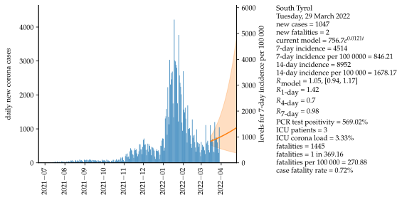
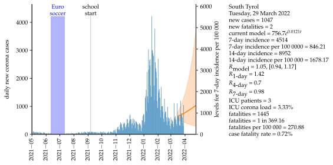
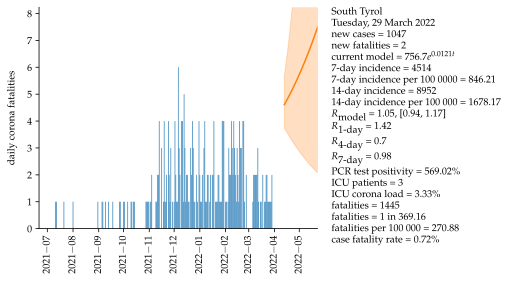
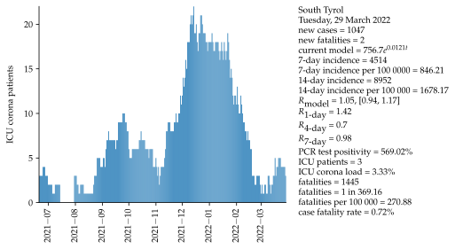

# South Tyrol

Mathematical approximation and data for COVID-19 in South Tyrol, Italy. Data starts on 6 October 2020. A second plot as been added zooming into pandemic starting on May 1, 2021. The mathematical approximation uses the last 14 days as a data basis, projecting the next 28 days. An exponential growth model using a serial interval of four days is assumed. Uncertainty of models is shown as an interval with one standard deviation to both sides of approximation.

### Second wave

### Comparison

### WHO indicators

<iframe src="html/TestPositivitySouthTyrolAll.html"
    sandbox="allow-same-origin allow-scripts"
    width="100%"
    height="550"
    scrolling="no"
    seamless="seamless"
    frameborder="0">
</iframe>

<iframe src="html/TestingResponseWHOSouthTyrolAll.html"
    sandbox="allow-same-origin allow-scripts"
    width="100%"
    height="550"
    scrolling="no"
    seamless="seamless"
    frameborder="0">
</iframe>

<iframe src="html/CaseIncidenceSouthTyrolAll.html"
    sandbox="allow-same-origin allow-scripts"
    width="100%"
    height="550"
    scrolling="no"
    seamless="seamless"
    frameborder="0">
</iframe>

<iframe src="html/MortalityWHOSouthTyrolAll.html"
    sandbox="allow-same-origin allow-scripts"
    width="100%"
    height="550"
    scrolling="no"
    seamless="seamless"
    frameborder="0">
</iframe>

### All data

<iframe src="html/currentlyPositiveTestedSouthTyrolAll.html"
    sandbox="allow-same-origin allow-scripts"
    width="100%"
    height="550"
    scrolling="no"
    seamless="seamless"
    frameborder="0">
</iframe>

<iframe src="html/newPositiveTotalSouthTyrolAll.html"
    sandbox="allow-same-origin allow-scripts"
    width="100%"
    height="550"
    scrolling="no"
    seamless="seamless"
    frameborder="0">
</iframe>

<iframe src="html/positiveTestedSouthTyrolAll.html"
    sandbox="allow-same-origin allow-scripts"
    width="100%"
    height="550"
    scrolling="no"
    seamless="seamless"
    frameborder="0">
</iframe>

<iframe src="html/deceasedSouthTyrolAll.html"
    sandbox="allow-same-origin allow-scripts"
    width="100%"
    height="550"
    scrolling="no"
    seamless="seamless"
    frameborder="0">
</iframe>

<iframe src="html/newDeceasedSouthTyrolAll.html"
    sandbox="allow-same-origin allow-scripts"
    width="100%"
    height="550"
    scrolling="no"
    seamless="seamless"
    frameborder="0">
</iframe>

<iframe src="html/FatalityRateSouthTyrolAll.html"
    sandbox="allow-same-origin allow-scripts"
    width="100%"
    height="550"
    scrolling="no"
    seamless="seamless"
    frameborder="0">
</iframe>

<iframe src="html/numberHospitalizedPeopleSouthTyrolAll.html"
    sandbox="allow-same-origin allow-scripts"
    width="100%"
    height="550"
    scrolling="no"
    seamless="seamless"
    frameborder="0">
</iframe>

<iframe src="html/numberIntensiveTherapySouthTyrolAll.html"
    sandbox="allow-same-origin allow-scripts"
    width="100%"
    height="550"
    scrolling="no"
    seamless="seamless"
    frameborder="0">
</iframe>

<iframe src="html/ICULoadSouthTyrolAll.html"
    sandbox="allow-same-origin allow-scripts"
    width="100%"
    height="550"
    scrolling="no"
    seamless="seamless"
    frameborder="0">
</iframe>

<iframe src="html/newNumberTestedPeopleSouthTyrolAll.html"
    sandbox="allow-same-origin allow-scripts"
    width="100%"
    height="550"
    scrolling="no"
    seamless="seamless"
    frameborder="0">
</iframe>

### Basis data

Number of ICU beds = 90 [[4]](#4).

Population = 533439 [[2]](#2).

Corona values in South Tyrol [[1]](#1),[[5]](#5).

### Assumptions

Exponential growth.

Serial interval = 4 days [[3]](#3).

Fatality interval (between test and fatality) = 4 weeks.

Basic reproduction number R0 = 5.7 [[7]](#7).

Calculation of effective reproduction number Rt is carried out via a four-day mean  R4 and a seven-day mean R7 (considering the serial interval), see [[3]](#3). The model-based approximation utilizes the exponential model to find the effective reproduction number.

Assumptions for community spreading ([[6]](#6)).:\
Testing positivity:\
 <2%: low incidence of community spreading,\
 <5%: moderate incidence of community spreading,\
 <20%: high incidence of community spreading,\
 \>20%: very high incidence of community spreading.\
Hospitalization rate:\
 <5%: low incidence of community spreading,\
 <10%: moderate incidence of community spreading,\
 <30%: high incidence of community spreading,\
 \>30%: very high incidence of community spreading.

### Sources

<a id="1">[1]</a>
<http://www.provinz.bz.it/sicherheit-zivilschutz/zivilschutz/aktuelle-daten-zum-coronavirus.asp>

<a id="2">[2]</a>
<https://astat.provinz.bz.it/de/bevoelkerung.asp>

<a id="3">[3]</a>
<https://www.rki.de/DE/Content/InfAZ/N/Neuartiges_Coronavirus/Projekte_RKI/R-Wert-Erlaeuterung.pdf?__blob=publicationFile>

<a id="4">[4]</a>
<https://www.stol.it/artikel/chronik/die-angst-vor-der-naechsten-corona-welle>

<a id="5">[5]</a>
<http://api.corona-bz.simedia.cloud/>

<a id="6">[6]</a>
<https://www.who.int/publications/i/item/considerations-in-adjusting-public-health-and-social-measures-in-the-context-of-covid-19-interim-guidance>

<a id="7">[7]</a>
Sanche, S.; Lin, Y. T.; Xu, C.; Romero-Severson, E.; Hengartner, E.; Ke, R. (2020). "High Contagiousness and Rapid Spread of Severe Acute Respiratory Syndrome Coronavirus 2". Emerging Infectious Diseases. 26 (7):1470–1477. doi:10.3201/eid2607.200282.
