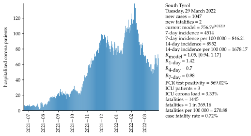
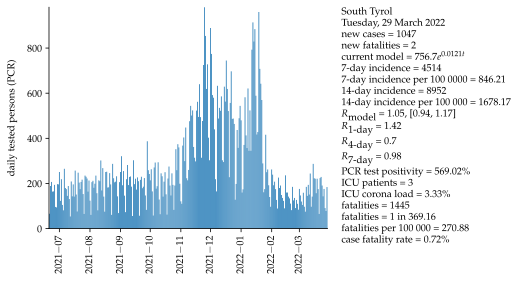

# South Tyrol

Mathematical approximation and data for COVID-19 in South Tyrol, Italy. Second-wave data starts on 6 October 2020. For the mathematical approximation, the last 14 days are used as a data basis, projecting the next 28 days. Exponential growth and a serial interval of four days are assumed.

### Second wave:

### WHO indicators:

<iframe src="html/TestPositivitySouthTyrolAll.html"
    sandbox="allow-same-origin allow-scripts"
    width="100%"
    height="550"
    scrolling="no"
    seamless="seamless"
    frameborder="0">
</iframe>

<iframe src="html/TestingResponseWHOSouthTyrolAll.html"
    sandbox="allow-same-origin allow-scripts"
    width="100%"
    height="550"
    scrolling="no"
    seamless="seamless"
    frameborder="0">
</iframe>

<iframe src="html/CaseIncidenceSouthTyrolAll.html"
    sandbox="allow-same-origin allow-scripts"
    width="100%"
    height="550"
    scrolling="no"
    seamless="seamless"
    frameborder="0">
</iframe>

<iframe src="html/MortalityWHOSouthTyrolAll.html"
    sandbox="allow-same-origin allow-scripts"
    width="100%"
    height="550"
    scrolling="no"
    seamless="seamless"
    frameborder="0">
</iframe>

### All data:
<iframe src="html/currentlyPositiveTestedSouthTyrolAll.html"
    sandbox="allow-same-origin allow-scripts"
    width="100%"
    height="550"
    scrolling="no"
    seamless="seamless"
    frameborder="0">
</iframe>

<iframe src="html/newPositiveTestedSouthTyrolAll.html"
    sandbox="allow-same-origin allow-scripts"
    width="100%"
    height="550"
    scrolling="no"
    seamless="seamless"
    frameborder="0">
</iframe>

<iframe src="html/positiveTestedSouthTyrolAll.html"
    sandbox="allow-same-origin allow-scripts"
    width="100%"
    height="550"
    scrolling="no"
    seamless="seamless"
    frameborder="0">
</iframe>

<iframe src="html/deceasedSouthTyrolAll.html"
    sandbox="allow-same-origin allow-scripts"
    width="100%"
    height="550"
    scrolling="no"
    seamless="seamless"
    frameborder="0">
</iframe>

<iframe src="html/newDeceasedSouthTyrolAll.html"
    sandbox="allow-same-origin allow-scripts"
    width="100%"
    height="550"
    scrolling="no"
    seamless="seamless"
    frameborder="0">
</iframe>

<iframe src="html/FatalityRateSouthTyrolAll.html"
    sandbox="allow-same-origin allow-scripts"
    width="100%"
    height="550"
    scrolling="no"
    seamless="seamless"
    frameborder="0">
</iframe>

<iframe src="html/ICULoadSouthTyrolAll.html"
    sandbox="allow-same-origin allow-scripts"
    width="100%"
    height="550"
    scrolling="no"
    seamless="seamless"
    frameborder="0">
</iframe>

<iframe src="html/newNumberTestedPeopleSouthTyrolAll.html"
    sandbox="allow-same-origin allow-scripts"
    width="100%"
    height="550"
    scrolling="no"
    seamless="seamless"
    frameborder="0">
</iframe>

### Basis data:
Number of ICU beds = 90 [[4]](#4).

Population = 533439 [[2]](#2).

Corona values in South Tyrol [[1]](#1),[[5]](#5).

### Assumptions:
Exponential growth.

Serial interval = 4 days [[3]](#3).

Fatality interval (between test and fatality) = 4 weeks.

Calculation of R4 and R7, see [[3]](#3).

Assumptions for community spreading ([[6]](#6)).:\
Testing positivity:\
 <2%: low incidence of community spreading,\
 <5%: moderate incidence of community spreading,\
 <20%: high incidence of community spreading,\
 \>20%: very high incidence of community spreading.\
Hospitalization rate:\
 <5%: low incidence of community spreading,\
 <10%: moderate incidence of community spreading,\
 <30%: high incidence of community spreading,\
 \>30%: very high incidence of community spreading.

## Sources
<a id="1">[1]</a>
<http://www.provinz.bz.it/sicherheit-zivilschutz/zivilschutz/aktuelle-daten-zum-coronavirus.asp>

<a id="2">[2]</a>
<https://astat.provinz.bz.it/de/bevoelkerung.asp>

<a id="3">[3]</a>
<https://www.rki.de/DE/Content/InfAZ/N/Neuartiges_Coronavirus/Projekte_RKI/R-Wert-Erlaeuterung.pdf?__blob=publicationFile>

<a id="4">[4]</a>
<https://www.stol.it/artikel/chronik/die-angst-vor-der-naechsten-corona-welle>

<a id="5">[5]</a>
<http://api.corona-bz.simedia.cloud/>

<a id="6">[6]</a>
<https://www.who.int/publications/i/item/considerations-in-adjusting-public-health-and-social-measures-in-the-context-of-covid-19-interim-guidance>
